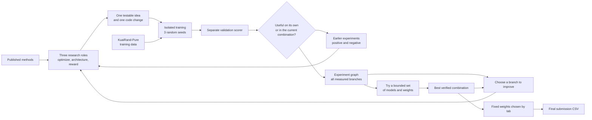
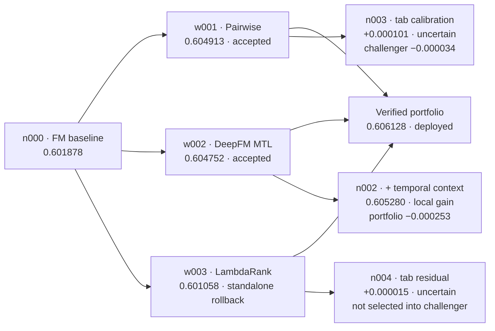
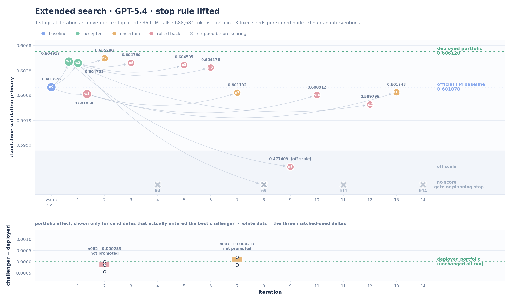
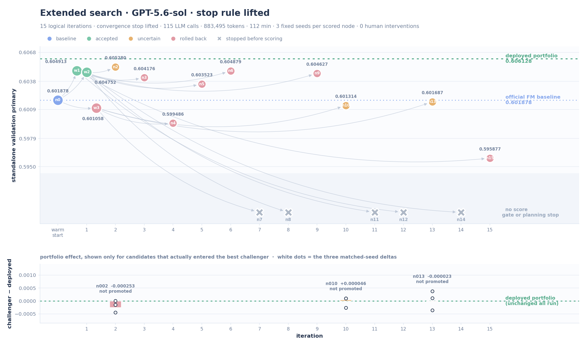

# AI Research Agent for Recommendation

**TikTok TechJam 2026 · Track 2**

> A research agent that improves both individual recommenders and the way they work together.

## The problem with following only the highest score

Many machine-learning agents follow one path: modify the current highest-scoring model, keep the change if that model improves, and repeat. That works when the goal is one model. It can fail when the final prediction combines several models.

We observed exactly this failure mode. LambdaRank was the weakest of our three models when measured on its own, but removing it caused the largest drop in the combined result:

| Model            |   Score on its own | Drop when removed from the combination |
| ---------------- | -----------------: | -------------------------------------: |
| Pairwise ranking |           0.604913 |                               0.000647 |
| DeepFM           |           0.604752 |                               0.000627 |
| LambdaRank       | **0.601058** |                     **0.000752** |

An agent that always expands the best individual model would spend the least attention on LambdaRank, even though LambdaRank contributes the most different information.

## Our answer

Our agent keeps a graph of measured experiments instead of one chain of successive models. It can return to an earlier branch, deliberately revisit every model in the current combination, or join ideas from different branches. Every candidate is judged in two ways:

1. Does it improve the model when measured on its own?
2. Does it improve the current combined result?

The second question is part of the search process, not an afterthought at the end. This changes the objective from “find the best single model” to “improve the complete recommendation system.”

The agent also turns published methods and earlier experiments into specific, testable changes. It records the exact parent model, code area, mechanism, result on its own, result in combination, and reason for keeping or rejecting the change. A failed implementation therefore does not incorrectly rule out an entire idea.

Our final solution combines three different models. It changes their weights according to the input field `tab`, using a small fixed table. The solution scored **0.6061277486** on validation and **0.5991** on the hidden test.

## Results

The official primary score is the average of GAUC and nDCG@5:

```text
primary score = (GAUC + nDCG@5) / 2
```

GAUC measures whether each user receives a good ordering overall. nDCG@5 focuses on the first five results shown to each user.

| Data split  |                 Method |               GAUC |             nDCG@5 |      Primary score |  Gain over baseline |
| ----------- | ---------------------: | -----------------: | -----------------: | -----------------: | ------------------: |
| Validation  |   Official FM baseline |             0.6674 |             0.5357 |             0.6016 |                  — |
| Validation  | **Our solution** | **0.673310** | **0.538946** | **0.606128** | **+0.004528** |
| Hidden test |   Official FM baseline |             0.6610 |             0.5282 |             0.5946 |                  — |
| Hidden test | **Our solution** |   **0.6666** |   **0.5317** |   **0.5991** |   **+0.0045** |

The hidden test was scored once, after all model choices and weights had been fixed. Hidden-test labels were never given to the agent or the training code. Exact values and the evaluation rules are in [docs/RESULTS.md](docs/RESULTS.md).

## Core contributions

1. **Search a graph, not one model chain.** The agent preserves successful, uncertain, and failed branches. It can revisit a model that is weak on its own when that model contributes different errors to the final combination.
2. **Optimize the final result during research.** Individual score and improvement to the current combination are two separate measurements. A candidate can be retained for either reason, with the reason recorded explicitly.
3. **Keep three decisions separate.** The highest validation point estimate remains available for exploration; a branch needs stronger repeated evidence before it becomes a safe starting point for later changes; and the deployed combination changes only after a direct comparison with the current one. This avoids both discarding promising ideas too early and promoting a lucky result.
4. **Give the agent useful recommendation feedback.** The agent sees aggregate summaries such as the loss caused by removing each member, similarity between model rankings, and performance by `tab`, user history, and item popularity. These summaries tell it where a complementary model can help without exposing row-level labels.
5. **Make prior knowledge executable.** A proposal must identify the earlier evidence, exact parent, code path, expected observation, and condition that would disprove it. Saved strong solutions are retrained and checked before use; unused settings and changes that do not alter predictions are rejected.
6. **Use a small, robust final combination.** The final step tries a bounded set of model subsets and weights. It keeps weaker but complementary members in the search and uses the same combining code for validation and submission inference.

Label separation, isolated execution, data and code hashes, three-seed evaluation, and complete logs are the engineering foundation that makes these contributions measurable. They are important safeguards, but they are not presented as the main research novelty.

## How earlier work shaped the design

We build on several agent systems below. 

| Earlier work                                                                                                            | What we adopted                                                                                   | What we added for this project                                                                                                          |
| ----------------------------------------------------------------------------------------------------------------------- | ------------------------------------------------------------------------------------------------- | --------------------------------------------------------------------------------------------------------------------------------------- |
| [AIDE](https://arxiv.org/abs/2502.13138)                                                                                 | Search over a tree of executable solutions instead of editing one file linearly                   | Branch selection also uses contribution to the final model combination, and deliberately rotates through currently deployed specialists |
| [MLE-STAR](https://research.google/pubs/mle-star-machine-learning-engineering-agent-via-search-and-targeted-refinement/) | Start from prior solutions, refine important code blocks, and combine strong solutions at the end | Combination value becomes feedback during the search; final subset and weight search is bounded and uses repeated comparisons           |
| [RD-Agent](https://github.com/microsoft/RD-Agent)                                                                        | The loop from hypothesis to experiment, implementation, execution, and feedback                   | Each memory entry is tied to the exact parent, code mechanism, evidence, and both individual and combined results                       |
| [MLE-bench](https://github.com/openai/mle-bench)                                                                         | Separated evaluation and reproducible execution records                                           | Task-specific label boundaries, recommendation metrics, output checks, and one-time hidden-test reporting                               |
| [Self-Evolving Recommendation System](https://arxiv.org/abs/2602.10226)                                                  | Separate optimizer, architecture, and reward-focused research roles                               | All three roles share the same experiment graph and receive combination and recommendation-slice feedback                               |
| [MLEvolve](https://github.com/InternScience/MLEvolve)                                                                    | Graph search, memory, stagnation detection, and joining ideas from different branches             | A lighter search that fits the experiment budget and prioritizes branches already contributing to the final combination                 |

The detailed design lineage, including what is borrowed and what is specific to our system, is in [docs/METHOD_LINEAGE.md](docs/METHOD_LINEAGE.md).

## From open discovery to a reproducible demonstration

The solution was developed in two stages.

**Stage 1 — discovery.** During development, we did not apply the final demonstration's early-stop rule to every search session. The agent continued exploring model, feature, objective, and combination branches. Good results, failed mechanisms, exact settings, and supporting measurements were saved into a prior store. The three models and the `tab` weight table in the final warm start came from this agent-driven iteration process; they were not invented just before the demonstration.

**Stage 2 — reproducible run.** The final GPT-5.4 run received all verified prior evidence. Before proposing anything new, it had to reproduce all three warm-start models, their expected scores, and their fixed combination. This makes the best previously discovered solution executable inside the recorded run rather than merely quoting an old score.

The challenge run has a maximum of 50 iterations and stops when the best result improves by no more than `0.002` for three consecutive iterations (`N=3`, `ε=0.002`). This threshold is only a convergence trigger, not the minimum useful model gain and not the agent's search target. A `0.002` reset would require `ΔGAUC + ΔnDCG@5 > 0.004` because primary is their mean. It is also 47% of the complete `0.004250` gain that our final system achieved over the reproduced baseline. Once the strong portfolio had been loaded, plausible marginal gains were therefore much smaller than the reset threshold.

The recorded run reproduced the warm start and then stopped after three new experiments that did not change the best deployed combination. That is compliance with the required stopping rule, not a three-iteration limit in the agent design.

## Overall flow



The loop on the left shows research over several branches. The path on the right shows model selection and final prediction. The important connection is the feedback from the current combination back into the next branch choice.

## Final recommendation method

### Three models that learn different patterns

| Model                        | What it does                                                                                                                                                                             | Why it is included                                                                                     |
| ---------------------------- | ---------------------------------------------------------------------------------------------------------------------------------------------------------------------------------------- | ------------------------------------------------------------------------------------------------------ |
| `w001` — pairwise ranking | Learns which of two videos a user is more likely to prefer. Watch time is used only while training. Prediction uses user and video IDs, hour, and time since the user's previous action. | Gives the strongest base ranking among the three saved models.                                         |
| `w002` — DeepFM           | Learns ID interactions for the main long-view target. During training only, like, follow, comment, and forward labels provide four extra learning signals.                               | Captures patterns that the pairwise model misses.                                                      |
| `w003` — LambdaRank       | Uses LightGBM trees to learn item and viewing-context patterns. Item statistics use earlier training dates only.                                                                         | Its score is lower by itself, but it improves the three-model result because its errors are different. |

Each model is trained three times with random seeds `0`, `1`, and `2`. For every user, each model's scores are first converted to ranks between 0 and 1. The ranks are then averaged. This prevents a model with numerically larger scores from dominating the result.

### Fixed weights selected by `tab`

The default weights are `0.4 / 0.4 / 0.2` for the pairwise model, DeepFM, and LambdaRank. For common `tab` values, the following fixed weights are used:

|         `tab` | Pairwise model | DeepFM | LambdaRank |
| --------------: | -------------: | -----: | ---------: |
|               0 |            0.1 |    0.6 |        0.3 |
|               1 |            0.3 |    0.4 |        0.3 |
|               2 |            0.9 |    0.0 |        0.1 |
|               4 |            0.5 |    0.4 |        0.1 |
|               6 |            0.0 |    0.3 |        0.7 |
| any other value |            0.4 |    0.4 |        0.2 |

These values came from the agent-driven discovery stage. Together, the three models and their weights form the **warm start**: a previously tested solution used as the starting point for the reproducible GPT-5.4 experiment. The final run does not trust the saved score blindly. It retrains all three members with seeds `0`, `1`, and `2`, checks their code and prediction hashes, reconstructs the fixed combination, verifies the expected validation score, and confirms that no test label was used. If any check fails, the experiment stops. The exact table is stored in [artifacts/final/weights-by-tab.json](artifacts/final/weights-by-tab.json).

## How the agent tests a change

Each round is straightforward:

```text
review past results → choose one idea → change the code → check safety
→ train with three seeds → calculate validation scores → keep or discard
```

- The agent may change only `candidate/pipeline.py`.
- Model training runs in an isolated process with no network access.
- The process has fixed time and memory limits.
- The separate scorer returns GAUC, nDCG@5, and error summaries, but never returns labels.
- A promising point estimate may remain available for exploration without becoming the next default starting point.
- The final combination changes only after a direct repeated comparison with the current one.
- Small or unclear changes remain recorded but are not described as proven improvements.
- The experiment stops after three rounds without a large enough gain.

## Recorded experiment

| Item                      | Value                                                                 |
| ------------------------- | --------------------------------------------------------------------- |
| Agent model               | GPT-5.4                                                               |
| Experiment rounds         | 4 logical rounds: reproduce the warm start, then test three new ideas |
| Maximum allowed           | 50 rounds                                                             |
| Why it stopped            | Required rule: three rounds in a row improved by no more than 0.002   |
| LLM calls                 | 17                                                                    |
| Tokens                    | 115,645 total: 101,754 input + 13,891 output                          |
| Total time                | 1,266.963 seconds, about 21 minutes 7 seconds                         |
| GPU use                   | 0 hours; all model training used CPU                                  |
| Human changes after start | 0                                                                     |
| Final file and data check | Passed                                                                |

The following is a compact snapshot of the graph saved by that run. The labels distinguish a model's standalone result from its effect on the deployed portfolio.



This graph captures three different outcomes that a scalar leaderboard would collapse together:

- `w001` and `w002` were clear standalone successes and became complementary portfolio members.
- `w003` was rolled back as a standalone successor to the baseline, yet remained valuable as a specialist: removing it caused the largest portfolio loss. This is exactly why exploration, stable-parent, and deployment decisions are separate.
- `n002` was a local success—the best new individual model at `0.605280`—but a system-level non-promotion because its best challenger portfolio was `0.000253` worse. `n003` entered a later challenger that was `0.000034` worse; `n004` did not enter the best challenger at all. Both changed predictions as intended, but their tiny standalone gains had intervals crossing zero, so both remained uncertain branches.

The convergence history was `0.601878 → 0.606128 → 0.606128 → 0.606128 → 0.606128`: the warm start produced the large gain, then three post-warm-start rounds produced zero deployed gain and triggered `N=3`. The final challenger combination scored `0.6060940663`, only `0.0000336823` below the incumbent, and was correctly rejected. [docs/RUN_LOGS.md](docs/RUN_LOGS.md) contains the complete success, failure, and evidence-gate analysis.

### One decision that shows why the checks matter

An experimental `tab` router for the challenger reached a higher raw point estimate of `0.606411`, but its matched-seed changes were `+0.000072`, `+0.000068`, and `−0.000017`; the confidence interval crossed zero. The router therefore failed its predeclared promotion gate. Without that unverified router, the challenger scored `0.606094`, below the `0.606128` incumbent. The agent retained both results as evidence without turning either one into an unsupported improvement claim.

## Extended searches with the stopping rule removed

The submitted run stops after three post-warm-start rounds because the challenge requires it. That
invites a fair objection: three experiments are a small basis for judging whether the agent can
actually do research on its own, and the rule may have hidden gains that were still available.

So we ran the agent twice more with the convergence stop disabled and a 15-iteration cap. Everything
else was held fixed — same prompt version, same warm start, same three seeds, same gate chain, same
trusted evaluator, same three-candidate drafting. The only difference between the two runs is which
model drives the controller. Both are validation-only: neither wrote a submission, and no hidden-test
label entered any decision.

|                                             | Run A                                     | Run B                                   |
| ------------------------------------------- | ----------------------------------------- | --------------------------------------- |
| Controller model                            | GPT-5.4                                   | GPT-5.6-sol                             |
| Run id                                      | `pilot-15round-gpt54-20260831-003`      | `pilot-15round-gpt56sol-20260831-001` |
| Logical rounds recorded                     | 13 (we ended the process during round 14) | 15 (reached the iteration cap)          |
| Autonomous experiments after the warm start | 12                                        | 14                                      |
| Experiments scored on three seeds           | 9                                         | 9                                       |
| LLM calls / tokens                          | 86 / 688,684                              | 115 / 883,495                           |
| Wall time                                   | 72 min                                    | 112 min                                 |
| Human interventions after start             | 0                                         | 0                                       |
| Best new standalone model                   | 0.605280                                  | 0.605280                                |
| Deployed combination at the end             | **0.606128, unchanged**             | **0.606128, unchanged**           |





Both figures are drawn directly from the saved decision records with
`python3 scripts/long_run_graphs.py render`, and use the dashboard's colours. The upper panel is the
search graph: each node is one experiment, placed at the round it ran and at its own validation
score, with an arrow from the model it was built on. The green dashed line is the deployed
combination. Nodes that never produced a score — stopped by a gate or by a failed proposal — sit in
the grey lane at the bottom. The lower panel shows what happened to the deployed combination, and
only for the candidates that actually reached the combination comparison.

### Twenty-six autonomous experiments moved the deployed combination by zero

That is the correct outcome, not a null one. Only three candidates ever entered the best challenger
combination across both runs, and the promotion gate rejected all three:

| Run | Round | Challenger | Point estimate vs deployed | Matched-seed changes              |  Seed mean | Promoted |
| --- | ----: | ---------: | -------------------------: | --------------------------------- | ---------: | -------- |
| A   |     7 |  0.6063444 |        **+0.000217** | −0.000158, +0.000200, −0.000132 | −0.000030 | no       |
| B   |    10 |  0.6061739 |        **+0.000046** | −0.000260, +0.000102, +0.000101  | −0.000019 | no       |
| B   |    13 |  0.6061052 |                 −0.000023 | −0.000353, +0.000110, +0.000377  |  +0.000045 | no       |

The gate is fixed in advance: a positive paired CI95 lower bound, **or** at least two of three matched
seeds positive with a mean gain of at least `0.0001` and a worst seed no lower than `−0.00005`.

Round 7 of Run A is the case these figures exist to make visible. It is the highest challenger either
run produced, `+0.000217` above the deployed `0.606128` — and two of its three seeds got worse. Round
13 of Run B is the mirror image: two of three seeds improved, but the point estimate fell and the
worst seed was `−0.000353`. An agent that ranks by a single validation number promotes the first and
discards the second. This one recorded both as evidence and promoted neither — over 26 unsupervised
rounds, no candidate was ever waved through on a point estimate alone.

### The two controller models searched the same way

Follow the arrows in either upper panel: every new experiment hangs off `w001`, `w002`, or `w003`, in
a strict `w002 → w001 → w003` cycle. Run B completed that rotation cleanly across all fourteen of its
rounds. This is the deliberate rotation through deployed members described above, and it is why the
weakest standalone member keeps receiving attention.

The first two operator-mode experiments were also the same two catalogued operators, in the same
order, in both runs. Because operators are deterministic, they reproduced bit-identical scores:
`0.6052800193085559` for temporal
context on DeepFM and `0.604175571136877` for static user-profile fields on the pairwise stack.
Changing the controller model changed which mechanisms were invented later; it did not change the
branch rotation, the evidence requirements, or the verdicts. The discipline is in the controller, not
in the language model.

### The ideas were varied; the ceiling held anyway

The 26 proposals edited four of the seven editable blocks — `features`, `target`, `train`, and
`predict` — across per-tab calibration and score mixtures, tab-6 mixture-of-experts and importance
weighting, user–author and repeat-exposure affinity counts, censored watch-time auxiliary heads,
soft-label and proxy-target reshaping, pairwise-versus-pointwise objective swaps, and user-balanced
sampling. None survived three seeds as an improvement. The ceiling looks like a property of this warm
start on this validation period rather than a shortage of ideas.

The clearest failure is Run A round 9, which replaced the true `long_view` target with a weighted
blend of other engagement labels, reasoning from a `0.76` training correlation between `is_click` and
`long_view`. It scored `0.477609`, about `0.128` below its parent and far below the official baseline
— the off-scale node in the first figure. The evaluator measured it, the reflection recorded that a
correlated label is not a usable substitute target, and the deployed combination was untouched. In a
design that edits one current-best model in place, that round is an expensive recovery. Here it is
one rolled-back branch.

### The failure rate of long-horizon autonomy, reported rather than hidden

Eight of the 26 experiments produced no score at all, and reaching 18 scored nodes took 45 patch
attempts. Where those attempts stopped:

| Outcome of a patch attempt             | Count | What it means                                       |
| -------------------------------------- | ----: | --------------------------------------------------- |
| Reached the three scored seeds         |    18 | measured result, kept in the graph                  |
| Rejected by the 20k-row smoke run (G4) |    16 | crashed before any seed was spent                   |
| Sent back by the implementation audit  |     8 | code could not be traced to the contract it claimed |
| Blocked by the static AST gate (G2)    |     3 | a block outside`target` tried to read `.label`  |

Of the eight rounds that produced no score, five exhausted their patch attempts against the gates
above. Two were refused by the deterministic proposal validator before any code was written — one
"fusion" candidate cited a single parent, one cited qualitative evidence with no numbers. One ended
in a controller-side JSON decoding failure after three retries.

So 27 of 45 model-written patches never earned a seed. We think that is the right trade: the gates
are cheap and the seeds are not, and all three label-boundary violations were caught by static
analysis before any code ran. But the cost is real, and a long autonomous run spends a substantial
share of its budget on repair rather than on science.

### What this means for the submitted run

The recorded submission run stopped after three post-warm-start rounds under `N=3`, `ε=0.002`.
Twenty-six further autonomous experiments, driven by two different controller models with that rule
switched off, changed the deployed combination by exactly zero. The stopping rule did not cut the
search short in a way that cost measurable score.

This is evidence about this warm start on this dataset, not a claim that no further gain exists.
Round 7 of Run A did shift the error pattern across `tab` slices rather than simply scoring lower; a
longer budget aimed at that kind of complementarity, rather than at further single-model refinement,
is the direction we would take next.


## Files in this repository

```text
.
├── candidate/                 # Model training file that the agent may change
├── orchestrator/              # Agent loop, experiment history and error handling
├── trusted/                   # Data checks, scoring code and isolated execution
├── task_spec/                 # Safe data reader and metric code
├── empirical_priors/          # Warm-start settings from validation experiments
├── artifacts/
│   ├── final/                 # Final model files, fixed weights and submission CSV
│   ├── experiment-records/    # Recorded settings, code changes, scores and decisions
│   └── long-run-records/      # Decision records of the two extended searches
├── docs/                      # Result, method and run documents, plus the figures
├── tests/                     # Tests for the agent and data-safety rules
├── scripts/                   # Reproduction, figure and upload checks
├── visualization/             # Read-only live experiment graph dashboard
├── env.lock.json              # Exact library versions used in the experiment
└── manifest.json              # Hashes of the data, code and libraries
```

The submission does not include datasets, generated data copies, validation-label caches, virtual environments, temporary prediction arrays, earlier trial folders, or API keys. Those files are either public inputs or can be rebuilt.

## Setup

### Requirements

- Linux and Python 3.10 or newer
- `bubblewrap` (`bwrap`), which starts the isolated process used for model training
- The official KuaiRand-Pure data and Track 2 starter kit
- An OpenAI-compatible API key for running a new agent experiment
- No GPU is required

Place the directories side by side:

```text
parent-directory/
├── techjam-track2-submission/
├── KuaiRand-Pure/
│   └── data/
└── kuairand-starter-kit/
```

Install the two separate environments and prepare the data:

```bash
cd techjam-track2-submission

# Environment for the GPT-5.4 agent and experiment controller.
python3 -m venv .orchestrator-venv
. .orchestrator-venv/bin/activate
python -m pip install -r requirements-orchestrator.txt

# CPU libraries for model training.
bash trusted/make_venv.sh

# Training data visible to the model code, plus labels visible only to the scorer.
python3 trusted/make_views.py --src ../KuaiRand-Pure/data --out views/agent
python3 trusted/evaluator.py --build-cache --src ../KuaiRand-Pure/data

# Confirm that the official data, starter kit and library versions match this record.
python3 trusted/manifest.py --verify
```

Copy `.env.example` to `.env` and fill in `OPENAI_API_KEY`. Never commit `.env`.

## Check and reproduce

### Quick upload check

These commands need no dataset or API key. One test that inspects generated data is skipped until setup creates `views/agent`; it runs normally after setup.

```bash
python3 scripts/preflight.py
python3 -m unittest discover -s tests -v
```

### Repeat the complete GPT-5.4 experiment

After setup, run:

```bash
bash scripts/run_experiment.sh
```

The script uses GPT-5.4 and the saved warm-start settings. It creates a new experiment ID. The agent's new proposals may vary, but the program must first reproduce `0.6061277485758569` from the warm start or it stops.

### Watch the experiment graph while the agent works

After the run directory appears, start the read-only viewer in another terminal:

```bash
python3 scripts/serve_experiment_graph.py \
  --run-dir runs/<experiment-id> --open
```

The light-theme page refreshes every two seconds. It shows:

- which measured model each new experiment was built from;
- ideas borrowed from other branches as dashed links;
- experiments that were kept, uncertain, rolled back, or stopped before training;
- the current phase: planning, code checking, three-seed training, or combination comparison;
- individual score, change from the parent, confidence interval, and combination change;
- the models and weights in the best verified combination;
- direct links to the proposal, code change, metrics, and reflection files.

The viewer reads saved artifacts and `live-status.json`; it never writes to model code, predictions,
labels, or scores. It also works after a run has finished:

```bash
python3 scripts/serve_experiment_graph.py \
  --run-dir artifacts/experiment-records --open
```

See [docs/LIVE_EXPERIMENT_GRAPH.md](docs/LIVE_EXPERIMENT_GRAPH.md) for the visual language and
implementation details.

The submitted file is already included at [artifacts/final/submission.csv](artifacts/final/submission.csv):

- 170,588 data rows plus one header row
- columns: `row_id,user_id,video_id,score`
- SHA-256: `eb1db430f8fdce35bcc3dd0c8eacc68565d3bc75dd667f841bc560816bc4aa50`
- official format check: passed

## Experiment records

The following files make every result traceable:

- [experiment settings](artifacts/experiment-records/config.json)
- [short result summary](artifacts/experiment-records/summary.json)
- [complete event log](artifacts/experiment-records/journal.jsonl)
- [warm-start check](artifacts/experiment-records/warmstart/verification.json)
- [final model-combination decision](artifacts/experiment-records/ensemble/selection.json)
- each round's idea, code change, three training results, scores, error comparison, and final decision under `artifacts/experiment-records/iter-*`
- [decision records of the two extended searches](artifacts/long-run-records/), which back every number in the section above and regenerate both figures with `python3 scripts/long_run_graphs.py render`

## Limitations

- We used KuaiRand-Pure only. We did not use the optional extra datasets.
- The `tab` weight table was chosen on one validation time period. It improved all three seed comparisons, but the improvement is small enough that it could still be caused by measurement noise; we therefore report it as consistent but not conclusive.
- The reproducible experiment begins from agent-generated prior work. It verifies that solution and then tests new ideas; it is designed to prove that the known best can be reproduced, not to rediscover every component from an empty file within three post-warm-start rounds.
- The recorded run stopped under the challenge's `N=3`, `ε=0.002` rule. This is a coarse stopping threshold relative to the remaining local improvement scale; it is not a claim that useful gains below `0.002` do not exist. Two extended searches with that rule removed produced no promotable gain in 26 further autonomous experiments, which bounds what the stop cost us but does not prove the ceiling is general.
- Repeating the agent experiment requires an LLM API and Linux support for `bubblewrap`.
- The hidden-test result is a final report only and was not used to choose models, weights, or code changes.

## Tools and data

- Data: official KuaiRand-Pure files only; no external training data
- Agent model: GPT-5.4; the extended searches also ran the same controller on GPT-5.6-sol
- Internet searches during the recorded experiment: 0; the agent used the saved local research notes
- Model libraries: NumPy, SciPy, scikit-learn, LightGBM, PyTorch CPU, RecBole, and TorchRec
- Exact library versions: `env.lock.json`

## Team and contributions

| Member                 | Contact               | Contribution                                                                                                                                                                                                                                                                                 |
| ---------------------- | --------------------- | -------------------------------------------------------------------------------------------------------------------------------------------------------------------------------------------------------------------------------------------------------------------------------------------- |
| **Zhihan Yang**  | zhihan.yang@u.nus.edu | **Idea and implementation.** Problem framing as a combination-aware sequential research loop; experiment-graph search and the separate exploration, continuation, and deployment decisions; core agent orchestration and runtime; model portfolio, experiments, and final integration. |
| **Li Haixin**    | e1113229@u.nus.edu    | **Evaluation and quality assurance.** Metric and data-contract review, test-suite and preflight checks, robustness and failure-case triage, and reproduction of the reported results from saved artifacts.                                                                             |
| **Dong Yicheng** | DONG0195@e.ntu.edu.sg | **Experiment analysis and visualization.** Experiment-graph and dashboard review, run-log organization, decision-trace verification, and preparation of result tables and graph explanations.                                                                                          |
| **Minxi Chen**   | chen1997@e.ntu.edu.sg | **Documentation and submission materials.** README and Devpost description review, judge-facing explanations, experiment narrative, team documentation, and final submission checklist.                                                                                                |
| **Qian Nuowen**  | qian_nuowen@u.nus.edu | **Research support.** Prior-art survey on ML research agents and recommender optimization, public-solution comparison notes, method-lineage review, and feedback on the diagnostic and portfolio-aware search design.                                                                  |
