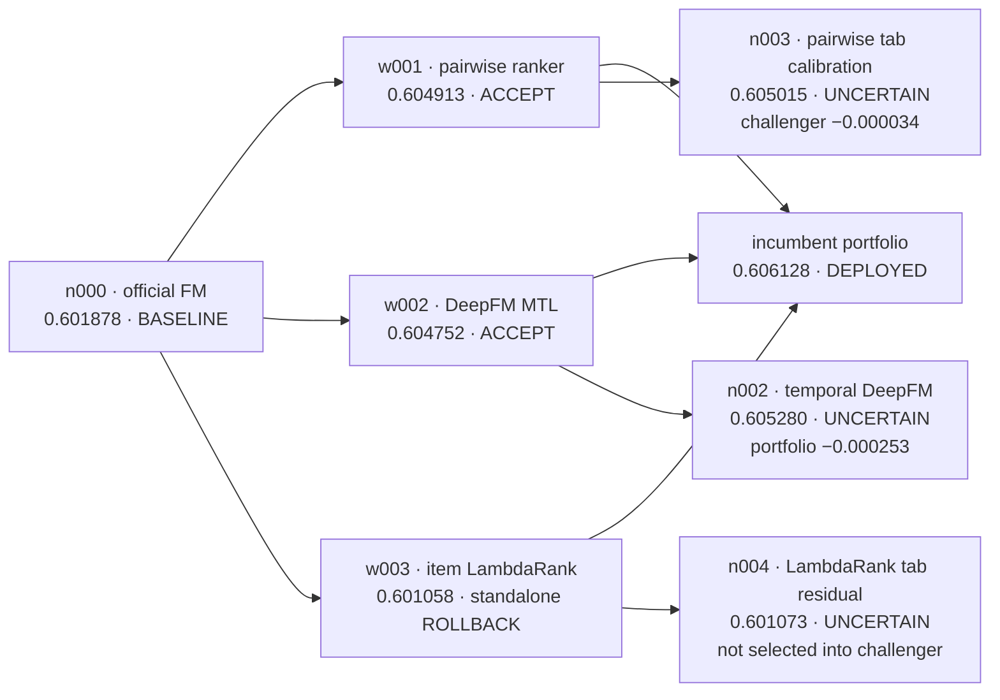

# Experiment graph and decision log

Agent model: GPT-5.4  
Result: stopped after progress became small; final file and data check passed

## Why this run starts from prior evidence

Before this recorded run, the agent explored model, feature, objective, and combination branches across repeated development sessions. Verified strong solutions, negative results, and exact settings were saved as prior evidence.

The recorded run received that evidence so the best discovery would be reproducible. It did not accept the saved score on trust: round 1 retrained the three warm-start models with three seeds, checked their hashes and scores, and reconstructed the expected combination before any new proposal was allowed.

## Submitted graph snapshot

This is a static rendering of the measured parent-child structure in
`artifacts/experiment-records/frontier.json`. It complements the interactive dashboard and remains
readable directly on GitHub.



`w003` is intentionally shown as both a standalone rollback and an edge into the deployed
portfolio. There is no contradiction: its point estimate did not justify replacing the baseline as
a stable standalone parent, but its ranking was the least similar to the other members and removing
it caused the largest combination loss. The agent records exploration value, safe continuation, and
deployment value as separate decisions.

## Four logical rounds

| Round | Hypothesis and measured mechanism | Standalone evidence | Portfolio evidence | Decision and lesson |
|---:|---|---:|---:|---|
| 1 | Reproduce three prior members and the fixed label-free `tab` router | best member `0.604913` | **`0.606128`** | **Success.** All members, hashes, seeds, and the expected portfolio reproduced before new search began. |
| 2 | Give DeepFM legal hour and strictly earlier user-gap categories so feature crosses can repair context errors | **`0.605280`**, `+0.000528`; CI crosses zero | `−0.000253` | **Local success, deployment non-promotion.** It became the best new individual model, but duplicated information already present in the portfolio. Keep as an uncertain branch, not as the deployed result. |
| 3 | Apply bounded `tab`-specific affine calibration to the pairwise model at prediction time | `0.605015`, `+0.000101`; CI crosses zero | entered a challenger `−0.000034` below incumbent | **Evidence insufficient.** The code changed rankings, but did not repair the intended weak tabs. Prefer train-time interactions over further manual score shifts. |
| 4 | Apply a `tab`-conditioned prediction residual to the existing LambdaRank member | `0.601073`, `+0.000015`; CI crosses zero | did not enter the best challenger | **Evidence insufficient.** Tab 2 improved, tab 4 regressed, and the candidate added no portfolio value. Do not infer correction constants from portfolio-relative slices alone. |

Round 4 did **not** train an unrelated new tree. It modified the prediction path of the verified
LambdaRank branch. This distinction matters because the negative result falsifies that specific
fixed-residual implementation, not the broader idea of tree rankers or context modeling.

## What succeeded, what failed, and what was rolled back

A binary “worked/failed” label loses the most important part of the record. We use four meanings:

| Outcome | Evidence in this run | Interpretation |
|---|---|---|
| Standalone and portfolio success | `w001`, `w002`, and the verified three-member portfolio | The mechanism improved ranking and earned a role in the final system. |
| Standalone rollback but portfolio success | `w003` | Weak alone, valuable because its errors are different; removal costs `0.000752`, the largest of the three members. |
| Standalone improvement but portfolio non-promotion | `n002` | A real local gain is not automatically a system gain. Its challenger portfolio scored `0.605875`, below `0.606128`. |
| Mechanism active, evidence insufficient | `n003`, `n004` | Prediction hashes changed, so these were not broken implementations. Effects were too small or inconsistent; `n003` entered a worse challenger and `n004` did not enter the best challenger. |

This is why “rollback” is a safety result rather than wasted work. The code change does not overwrite
the incumbent; the node, its exact parent, metrics, slice effects, and reflection stay in the graph.
Later rounds can avoid the exact failed parameterization while testing a materially different
mechanism.

The final selector provided one more deliberate non-promotion. A newly fitted challenger `tab`
router produced a raw point estimate of `0.606411`, but its matched-seed changes over the global
challenger were only `+0.000072`, `+0.000068`, and `−0.000017` (mean `+0.000041`; CI crossed zero).
It failed the predeclared contextual promotion gate. The verified version of the challenger then
scored `0.606094`, which was `0.0000336823` below the incumbent. Neither tempting number was used to
claim an improvement.

## Why convergence happened after three new ideas

The official counter resets only when the **best deployed validation primary** improves by more than
`ε=0.002`; it stops at `N=3` consecutive smaller gains. It does not reject every useful candidate
below `0.002`, and the agent prompt explicitly tells the model not to optimize toward that threshold.

The threshold is large at the warm-start operating point:

- because `primary = (GAUC + nDCG@5) / 2`, resetting the counter requires
  `ΔGAUC + ΔnDCG@5 > 0.004`;
- `0.002` is about 47% of the final system's entire `0.004250` gain over the reproduced baseline;
- the best new standalone change was only `+0.000528`, and none improved the deployed portfolio.

The exact best-history record is:

```text
baseline       warm start      round 2       round 3       round 4
0.601878  ->   0.606128   ->   0.606128  ->  0.606128  ->  0.606128
                 +0.004250          +0            +0            +0
```

The run therefore stopped after rounds 2–4. We describe this as **local convergence under a coarse
required rule**, not as proof that the metric has no remaining mathematical headroom. Creative ideas
can still yield gains in the `1e-5` to `1e-3` range; the problem is that these gains are difficult to
separate from seed and slice variation and, more importantly, may not add new information to an
already heterogeneous portfolio.

The challenge allows at most 50 rounds. The recorded run stopped automatically under the rule above;
50 is a cap, not a target.

## Direct evidence index

| Claim | Saved record |
|---|---|
| Complete graph structure and node decisions | [`frontier.json`](../artifacts/experiment-records/frontier.json) |
| Best-history values, convergence counter, and resource use | [`summary.json`](../artifacts/experiment-records/summary.json) |
| Atomic warm-start reproduction | [`warmstart/verification.json`](../artifacts/experiment-records/warmstart/verification.json) |
| Round 2 hypothesis, score, combination test, and lesson | [`proposal`](../artifacts/experiment-records/iter-002/proposal.json) · [`metrics`](../artifacts/experiment-records/iter-002/metrics.json) · [`combination`](../artifacts/experiment-records/iter-002/ensemble-selection.json) · [`reflection`](../artifacts/experiment-records/iter-002/reflection.json) |
| Round 3 hypothesis, score, combination test, and lesson | [`proposal`](../artifacts/experiment-records/iter-003/proposal.json) · [`metrics`](../artifacts/experiment-records/iter-003/metrics.json) · [`combination`](../artifacts/experiment-records/iter-003/ensemble-selection.json) · [`reflection`](../artifacts/experiment-records/iter-003/reflection.json) |
| Round 4 hypothesis, score, combination test, and lesson | [`proposal`](../artifacts/experiment-records/iter-004/proposal.json) · [`metrics`](../artifacts/experiment-records/iter-004/metrics.json) · [`combination`](../artifacts/experiment-records/iter-004/ensemble-selection.json) · [`reflection`](../artifacts/experiment-records/iter-004/reflection.json) |
| Final challenger, rejected contextual router, and retained incumbent | [`ensemble/selection.json`](../artifacts/experiment-records/ensemble/selection.json) |

## Files saved for each round

Each `artifacts/experiment-records/iter-NNN/` directory contains:

- `proposal.json`: the idea, why it might work, the planned code change, and the required improvement;
- `attempt-0/pipeline.diff`: the exact code change;
- `attempt-0/static_gate.json`: checks for unsafe imports, label access, and invalid code patterns;
- `attempt-0/smoke.json`: a short check that the code starts and creates predictions;
- `attempt-0/seed_results.json`: training results for random seeds 0, 1, and 2;
- `metrics.json`: validation GAUC, nDCG@5, primary score, and variation across users and seeds;
- model error comparison: whether this model makes different errors from the other models (stored in each round's diagnostics JSON file);
- `ensemble-selection.json`: scores for tested model combinations;
- `reflection.json`: the decision to keep or discard the change and what to try next.

The complete time-ordered log is `artifacts/experiment-records/journal.jsonl`. A shorter summary is `artifacts/experiment-records/summary.json`. The final model choice is `artifacts/experiment-records/ensemble/selection.json`.

## Errors and recovery

The successful experiment had no out-of-memory error, timeout, invalid numeric value, or output-format error. Round 4 was not a software failure: its code ran correctly, but its score was not better. The program saved the result and kept the previous best solution.

One earlier launch stopped before model training because the host system did not allow `bubblewrap` to create the required `/proc` view. It produced no score and is not included as an experiment result. The successful experiment used the same settings on a host where the isolated process could start correctly.
